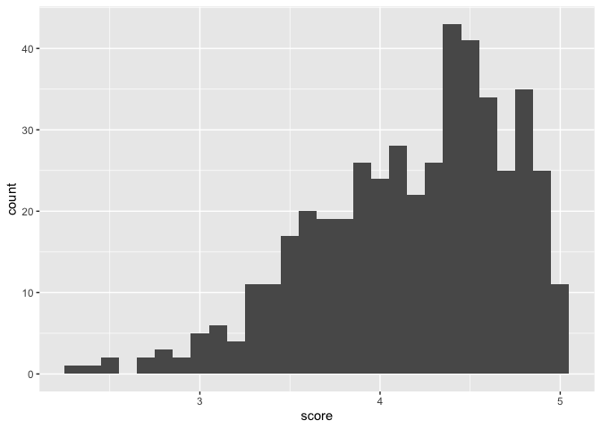
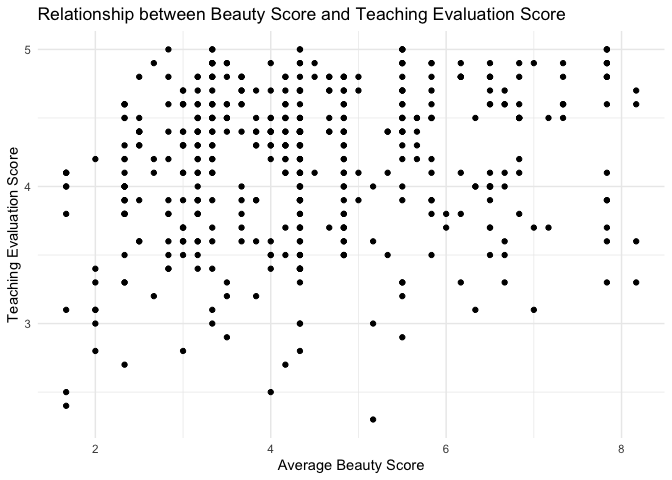
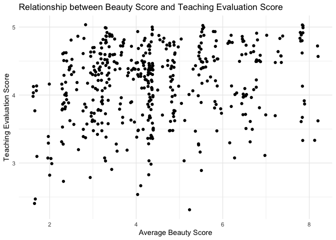
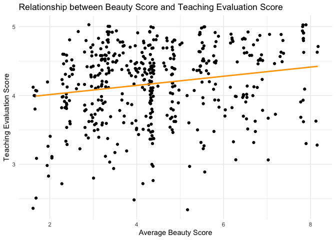

Lab 09 - Grading the professor, Pt. 1
================
Cynthia Jiao
3/16/2025

## Load Packages and Data

``` r
library(tidyverse) 
library(openintro)
library(broom)

print(evals)
```

    ## # A tibble: 463 × 23
    ##    course_id prof_id score rank    ethnicity gender language   age cls_perc_eval
    ##        <int>   <int> <dbl> <fct>   <fct>     <fct>  <fct>    <int>         <dbl>
    ##  1         1       1   4.7 tenure… minority  female english     36          55.8
    ##  2         2       1   4.1 tenure… minority  female english     36          68.8
    ##  3         3       1   3.9 tenure… minority  female english     36          60.8
    ##  4         4       1   4.8 tenure… minority  female english     36          62.6
    ##  5         5       2   4.6 tenured not mino… male   english     59          85  
    ##  6         6       2   4.3 tenured not mino… male   english     59          87.5
    ##  7         7       2   2.8 tenured not mino… male   english     59          88.6
    ##  8         8       3   4.1 tenured not mino… male   english     51         100  
    ##  9         9       3   3.4 tenured not mino… male   english     51          56.9
    ## 10        10       4   4.5 tenured not mino… female english     40          87.0
    ## # ℹ 453 more rows
    ## # ℹ 14 more variables: cls_did_eval <int>, cls_students <int>, cls_level <fct>,
    ## #   cls_profs <fct>, cls_credits <fct>, bty_f1lower <int>, bty_f1upper <int>,
    ## #   bty_f2upper <int>, bty_m1lower <int>, bty_m1upper <int>, bty_m2upper <int>,
    ## #   bty_avg <dbl>, pic_outfit <fct>, pic_color <fct>

``` r
?evals
```

## Exercise 1

The distribution of score is negatively/left skewed, because more
observations fall on the right side, leaving a long tail on the left.
From the summary statistics, the mean is 4.175, and the median 4.3. This
is consistent with the histogram, because a larger median (than mean)
typically features a left skewed distribution.

``` r
evals %>%
  ggplot(aes(x = score)) +
  geom_histogram(binwidth = 0.1)
```

<!-- -->

``` r
summary(evals$score)
```

    ##    Min. 1st Qu.  Median    Mean 3rd Qu.    Max. 
    ##   2.300   3.800   4.300   4.175   4.600   5.000

## Exercise 2

From the scatterplot, the relationship between average beauty rating and
evaluation scores is not very clear, but generally shows a weak positive
trend, where professors who get higher beauty scores on average also get
higher teaching evaluation scores.

``` r
evals %>%
  ggplot(aes(x = bty_avg, y = score)) +
  geom_point() +
  labs(
    title = "Relationship between Beauty Score and Teaching Evaluation Score",
    x = "Average Beauty Score",
    y = "Teaching Evaluation Score"
  ) +
  theme_minimal()
```

<!-- -->

## Exercise 3

This time, the positive relationship is easier to read and looks
stronger than the previous graph. I googled the difference between
geom_point and geom_jitter, and it explains that jitter means adding a
small amount of random variation to the location of each point, which is
a useful way of handling overlapping dots caused by discreteness in
smaller datasets. According to the first exercise, there are a lot of
score that fall within the same range, and geom_point can only show them
as overlapping points, which makes it harder to read the relationship
clealy from the first scatterplot. This could be misleading such that we
might think the relationship between score and bty_avg is not so strong
just by looking at the plot. After adding some random noise to each
point, the overlapped dots are more spread out and thus show a clearer
trend.

``` r
evals %>%
  ggplot(aes(x = bty_avg, y = score)) +
  geom_jitter() +
  labs(
    title = "Relationship between Beauty Score and Teaching Evaluation Score",
    x = "Average Beauty Score",
    y = "Teaching Evaluation Score"
  ) +
  theme_minimal()
```

<!-- -->

## Exercise 4

The slope is 0.067, and intercept is 3.88.

score = 0.067\*bty_avg + 3.88

``` r
m_bty <-lm(evals$score ~ evals$bty_avg)
summary(m_bty)
```

    ## 
    ## Call:
    ## lm(formula = evals$score ~ evals$bty_avg)
    ## 
    ## Residuals:
    ##     Min      1Q  Median      3Q     Max 
    ## -1.9246 -0.3690  0.1420  0.3977  0.9309 
    ## 
    ## Coefficients:
    ##               Estimate Std. Error t value Pr(>|t|)    
    ## (Intercept)    3.88034    0.07614   50.96  < 2e-16 ***
    ## evals$bty_avg  0.06664    0.01629    4.09 5.08e-05 ***
    ## ---
    ## Signif. codes:  0 '***' 0.001 '**' 0.01 '*' 0.05 '.' 0.1 ' ' 1
    ## 
    ## Residual standard error: 0.5348 on 461 degrees of freedom
    ## Multiple R-squared:  0.03502,    Adjusted R-squared:  0.03293 
    ## F-statistic: 16.73 on 1 and 461 DF,  p-value: 5.083e-05

## Exercise 5, 6, 7, & 8

According to the model, the slope is 0.067 and bty_avg is a significant
predictor of score. Therefore, bty_avg is a positively predictive of
score such that professors who are rated more beautiful on average also
tend to have higher teaching evaluation scores. This means that for
every 1 unit increase in bty_avg, the evaluation score increases by
0.06664. This relationship is clear on the graph, as the orange line
shows a weak yet positive trend.

The interpret of the slope being 3.88 doesn’t really make sense because
it means that when a professor has an average beauty rating of zero, the
predicted evaluation score will be 3.88. However, the lowest rating a
professor could possibly receive on their average beauty score is 1.
Zero is not a possible score, so the intercept of this model does not
have practical meaning. It’s more of a mathematical result from fitting
the model. It’s better to look at slope than intercept.

The R-squared of the model is 0.033, meaning that 3.3% of variance in
evaluation score is explained by average beauty score.

``` r
ggplot(evals, aes(x = bty_avg, y = score)) +
  geom_jitter() +  
  geom_smooth(method = "lm", color = "orange", se = FALSE) +  # Regression line in orange
  labs(title = "Relationship between Beauty Score and Teaching Evaluation Score",
       x = "Average Beauty Score",
       y = "Teaching Evaluation Score") +
  theme_minimal()
```

    ## `geom_smooth()` using formula = 'y ~ x'

<!-- -->

## Exercise 9 & 10

score = 0.14\*gender + 4.09

R appears to treat gender as a dummy coded variable, but I am not sure
which one is 0 and which one is 1. Regardless, this model means that
gender is a significant, positive predictor of score. For every one unit
of increase in gender (although I have no idea what this would mean
practically til I know which gender is coded as 0…), there will be 0.14
unit of increase in evaluation scores. In common English, it means that
being either male or female (whichever is coded as 1) will have higher
evaluation score than the other gender that is coded as 0.

Slope is equal to 4.09, meaning that when gender is 0 (again I don’t
know what this would mean since gender is categorical…), the evaluation
score will be 4.09. This means that being the gender that is coded as 0
will have a predicted evaluation score of 4.09.

I am guessing that male is coded as 1 and female is coded as 0,
therefore, here are equations for male and female professors.

score = 4.09 + 0.14(0) = 4.09 =\> female professor equation score =
4.09 + 0.14(1) = 4.23 =\> male professor equation

``` r
m_gen <-lm(evals$score ~ evals$gender)
summary(m_gen)
```

    ## 
    ## Call:
    ## lm(formula = evals$score ~ evals$gender)
    ## 
    ## Residuals:
    ##      Min       1Q   Median       3Q      Max 
    ## -1.83433 -0.36357  0.06567  0.40718  0.90718 
    ## 
    ## Coefficients:
    ##                  Estimate Std. Error t value Pr(>|t|)    
    ## (Intercept)       4.09282    0.03867 105.852  < 2e-16 ***
    ## evals$gendermale  0.14151    0.05082   2.784  0.00558 ** 
    ## ---
    ## Signif. codes:  0 '***' 0.001 '**' 0.01 '*' 0.05 '.' 0.1 ' ' 1
    ## 
    ## Residual standard error: 0.5399 on 461 degrees of freedom
    ## Multiple R-squared:  0.01654,    Adjusted R-squared:  0.01441 
    ## F-statistic: 7.753 on 1 and 461 DF,  p-value: 0.005583

``` r
## to make sure that r did code male as 1 and female as 0
evals <- evals %>%
  mutate(gender_coded = ifelse(gender == "female", 0, 1))

m_gen_coded <-lm(evals$score ~ evals$gender_coded)
summary(m_gen_coded)
```

    ## 
    ## Call:
    ## lm(formula = evals$score ~ evals$gender_coded)
    ## 
    ## Residuals:
    ##      Min       1Q   Median       3Q      Max 
    ## -1.83433 -0.36357  0.06567  0.40718  0.90718 
    ## 
    ## Coefficients:
    ##                    Estimate Std. Error t value Pr(>|t|)    
    ## (Intercept)         4.09282    0.03867 105.852  < 2e-16 ***
    ## evals$gender_coded  0.14151    0.05082   2.784  0.00558 ** 
    ## ---
    ## Signif. codes:  0 '***' 0.001 '**' 0.01 '*' 0.05 '.' 0.1 ' ' 1
    ## 
    ## Residual standard error: 0.5399 on 461 degrees of freedom
    ## Multiple R-squared:  0.01654,    Adjusted R-squared:  0.01441 
    ## F-statistic: 7.753 on 1 and 461 DF,  p-value: 0.005583

``` r
## yeah the coded model gives the exact same slope of 0.14 as m_gen, so yes, I am guess right that male is coded as 1 and female is coded as 0.
```

## Exercise 11

R seems to treat teaching professor as the reference group (coded as 0).

score = -0.145\*rank + 4.28 =\> contrast between tenured and teaching
professor

This model means that teaching professor (when rank = 0) is predicted to
have a 4.28 evaluation score. For every one unit of increase (when it’s
a tenured professor), there will be 0.145 unit of decrease in evaluation
score.

score = -0.13\*rank + 4.28 =\> contrast between tenure track and
teaching professor

This model means that teaching professor (when rank = 0) is predicted to
have a 4.28 evaluation score. For every one unit of increase (when it’s
a tenure track professor), there will be 0.13 unit of decrease in
evaluation score.

R-squared value is 0.007332, which indicates that the model explains
only about 0.73% of the variability in professor evaluation scores.
Based on the p value of both contrast, difference between teaching
vs. tenured is significant, but teaching vs. tenure track is not
significant.

``` r
m_rank <-lm(evals$score ~ evals$rank)
summary(m_rank)
```

    ## 
    ## Call:
    ## lm(formula = evals$score ~ evals$rank)
    ## 
    ## Residuals:
    ##     Min      1Q  Median      3Q     Max 
    ## -1.8546 -0.3391  0.1157  0.4305  0.8609 
    ## 
    ## Coefficients:
    ##                        Estimate Std. Error t value Pr(>|t|)    
    ## (Intercept)             4.28431    0.05365  79.853   <2e-16 ***
    ## evals$ranktenure track -0.12968    0.07482  -1.733   0.0837 .  
    ## evals$ranktenured      -0.14518    0.06355  -2.284   0.0228 *  
    ## ---
    ## Signif. codes:  0 '***' 0.001 '**' 0.01 '*' 0.05 '.' 0.1 ' ' 1
    ## 
    ## Residual standard error: 0.5419 on 460 degrees of freedom
    ## Multiple R-squared:  0.01163,    Adjusted R-squared:  0.007332 
    ## F-statistic: 2.706 on 2 and 460 DF,  p-value: 0.06786

## Exercise 12 & 13

When tenure track is the reference group, here are the models.

score = -0.016\*rank + 4.28 =\> contrast between tenure track and
tenured professor

This model means that tenure track professors (when rank = 0) are
predicted to have a 4.28 evaluation score. For every one unit increase
(when the professor is tenured, the evaluation score is expected to
decrease by 0.016 units.

score = 0.13 \* rank + 4.28 =\> contrast between tenure track and
teaching professor

This model means that tenure track professors (when rank = 0) are
predicted to have a 4.28 evaluation score. For every one unit increase
(when the professor is a teaching professor), the evaluation score is
expected to increase by 0.13 units.

R-squared value is 0.007332, which indicates that the model explains
only about 0.73% of the variability in professor evaluation scores.
Based on the p value of both contrast, difference between tenure track
vs. tenured and tenure track vs. teaching are not significant.

``` r
## if tenure track is the reference group (coded as 0)

evals$rank <- relevel(evals$rank, ref = "tenure track")
m_rank_relevel <-lm(evals$score ~ evals$rank)
summary(m_rank_relevel)
```

    ## 
    ## Call:
    ## lm(formula = evals$score ~ evals$rank)
    ## 
    ## Residuals:
    ##     Min      1Q  Median      3Q     Max 
    ## -1.8546 -0.3391  0.1157  0.4305  0.8609 
    ## 
    ## Coefficients:
    ##                    Estimate Std. Error t value Pr(>|t|)    
    ## (Intercept)         4.15463    0.05214  79.680   <2e-16 ***
    ## evals$rankteaching  0.12968    0.07482   1.733   0.0837 .  
    ## evals$ranktenured  -0.01550    0.06228  -0.249   0.8036    
    ## ---
    ## Signif. codes:  0 '***' 0.001 '**' 0.01 '*' 0.05 '.' 0.1 ' ' 1
    ## 
    ## Residual standard error: 0.5419 on 460 degrees of freedom
    ## Multiple R-squared:  0.01163,    Adjusted R-squared:  0.007332 
    ## F-statistic: 2.706 on 2 and 460 DF,  p-value: 0.06786

## Exercise 14 & 15

score = -0.14\*tenure_eligible + 4.28

When tenure_eligible = 0 (teaching professor), the predicted evaluation
score is 4.28. When tenure_eligible = 1 (tenure-track or tenured
professor), the evaluation score decreases by 0.1406 units on average.
p-value = 0.021, suggesting that tenure-eligible professor receive
slightly lower teaching evaluation scores compared to
non-tenure-eligible (teaching) faculty; the difference between “tenure
eligibleness” is statistically significant. R-squared is 0.00935,
meaning that tenure eligibility explains only about 0.94% of the
variance in evaluation scores.

``` r
evals <- evals %>%
  mutate(tenure_eligible = ifelse(rank == "teaching", "no", "yes"))

m_tenure_eligible <-lm(score ~ tenure_eligible, data = evals)
summary(m_tenure_eligible)
```

    ## 
    ## Call:
    ## lm(formula = score ~ tenure_eligible, data = evals)
    ## 
    ## Residuals:
    ##     Min      1Q  Median      3Q     Max 
    ## -1.8438 -0.3438  0.1157  0.4360  0.8562 
    ## 
    ## Coefficients:
    ##                    Estimate Std. Error t value Pr(>|t|)    
    ## (Intercept)          4.2843     0.0536  79.934   <2e-16 ***
    ## tenure_eligibleyes  -0.1406     0.0607  -2.315    0.021 *  
    ## ---
    ## Signif. codes:  0 '***' 0.001 '**' 0.01 '*' 0.05 '.' 0.1 ' ' 1
    ## 
    ## Residual standard error: 0.5413 on 461 degrees of freedom
    ## Multiple R-squared:  0.0115, Adjusted R-squared:  0.009352 
    ## F-statistic: 5.361 on 1 and 461 DF,  p-value: 0.02103
